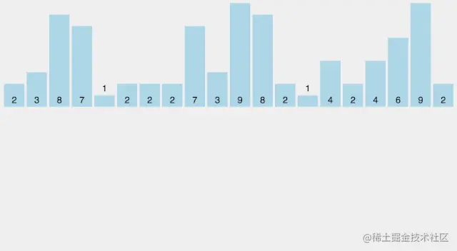

---
head:
  - - link
    - rel: stylesheet
      href: https://cdnjs.cloudflare.com/ajax/libs/KaTeX/0.5.1/katex.min.css
---
# Counting Sort 计数排序

## 1. 算法描述

`计数排序`（Counting Sort）是一种非基于比较的排序算法，是稳定的整数排序算法。计数排序由 Harold H. Seward 在 1954 年提出。它的基本思想是：对每一个输入元素 $x$，确定小于 $x$ 的元素个数。利用这一信息，就可以直接把 $x$ 放到它在输出数组中的位置上了。时间复杂度为 $O(n+k)$，空间复杂度为 $O(n+k)$，其中 $k$ 是临时数组的大小。

## 2. 动图演示



## 3. 代码实现

### 3.1 JavaScript 实现

<<< ./counting-sort.js

### 3.2 TypeScript 实现

<<< ./countingSort.ts

## 4. 使用示例

``` js
import countingSort from './countingSort';

const arr = [1, 3, 2, 5, 4];
console.log(countingSort(arr)); // [1, 2, 3, 4, 5]
```

## 5. 速度测试

::: tip
数组长度过大，网页可能会崩溃哦，请量力而行！
:::
<script setup>
import SortExample from './sort.vue'
</script>

<SortExample />

::: details 测试代码
<<< ../component/baseSort.vue
:::
