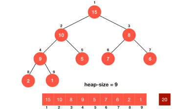

---
head:
  - - link
    - rel: stylesheet
      href: https://cdnjs.cloudflare.com/ajax/libs/KaTeX/0.5.1/katex.min.css
---
# Heap Sort 堆排序

## 1. 算法描述

`堆排序`（Heap Sort）是一种基于比较的排序算法，它的基本思想是：将待排序的序列构造成一个大顶堆，此时，整个序列的最大值就是堆顶的根节点。将它移走（其实就是将其与堆数组的末尾元素交换，此时末尾元素就是最大值），然后将剩余的 $n-1$ 个序列重新构造成一个堆，这样就会得到 $n$ 个元素中的次大值。如此反复执行，便能得到一个有序序列了。时间复杂度为 $O(nlogn)$，空间复杂度为 $O(1)$。

## 2. 动图演示



## 3. 代码实现

### 3.1 JavaScript 实现

<<< ./heap-sort.js

### 3.2 TypeScript 实现

<<< ./heapSort.ts

## 4. 使用示例

```js
import heapSort from './heap-sort.js';

const arr = [5, 2, 4, 6, 1, 3];
heapSort(arr);
console.log(arr); // [1, 2, 3, 4, 5, 6]

const arr1 = [{a: 1}, {a: 3}, {a: 2}, {a: 5}, {a: 4}];
heapSort(arr1, (a, b) => a.a > b.a);
console.log(arr1); // [{a: 1}, {a: 2}, {a: 3}, {a: 4}, {a: 5}]
```

## 5. 速度测试

::: tip
数组长度过大，网页可能会崩溃哦，请量力而行！
:::
<script setup>
import SortExample from './sort.vue'
</script>

<SortExample />

::: details 测试代码
<<< ../component/baseSort.vue
:::
