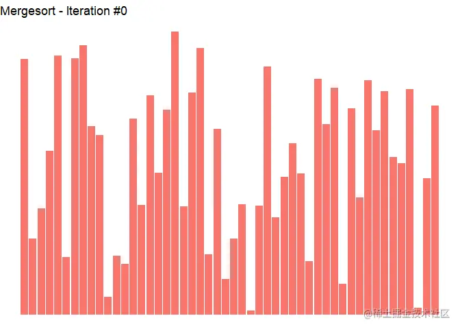

---
head:
  - - link
    - rel: stylesheet
      href: https://cdnjs.cloudflare.com/ajax/libs/KaTeX/0.5.1/katex.min.css
---
# Merge Sort 归并排序

## 1. 算法描述
  
`归并排序`（Merge Sort）是建立在归并操作上的一种有效的排序算法，该算法是采用分治法（Divide and Conquer）的一个非常典型的应用。归并排序是一种稳定的排序方法。归并排序的思想就是先递归分解数组，再合并数组。将数组分解最小之后，然后合并两个有序数组，基本思路是比较两个数组的最前面的数，谁小就先取谁，取了后相应的指针就往后移一位。然后再比较，直至一个数组为空，最后把另一个数组的剩余部分复制过来即可。时间复杂度为 $O(nlogn)$，空间复杂度为 $O(n)$。

## 2. 动图演示



## 3. 代码实现

### 3.1 JavaScript 实现

<<< ./merge-sort.js#mergeSort

### 3.2 TypeScript 实现

<<< ./mergeSort.ts

## 4. 使用示例

``` js
import mergeSort from './mergeSort';

const arr = [1, 3, 2, 5, 4];
console.log(mergeSort(arr)); // [1, 2, 3, 4, 5]

const arr1 = [{ a: 1 }, { a: 3 }, { a: 2 }, { a: 4 }];
mergeSort(arr1, (a, b) => a.a > b.a);
console.log(arr1); // [{ a: 1 }, { a: 2 }, { a: 3 }, { a: 4 }]
```

## 5. 速度测试

::: tip
数组长度过大，网页可能会崩溃哦，请量力而行！
:::
<script setup>
import SortExample from './sort.vue'
</script>

<SortExample />

::: details 测试代码
<<< ../component/baseSort.vue
:::
